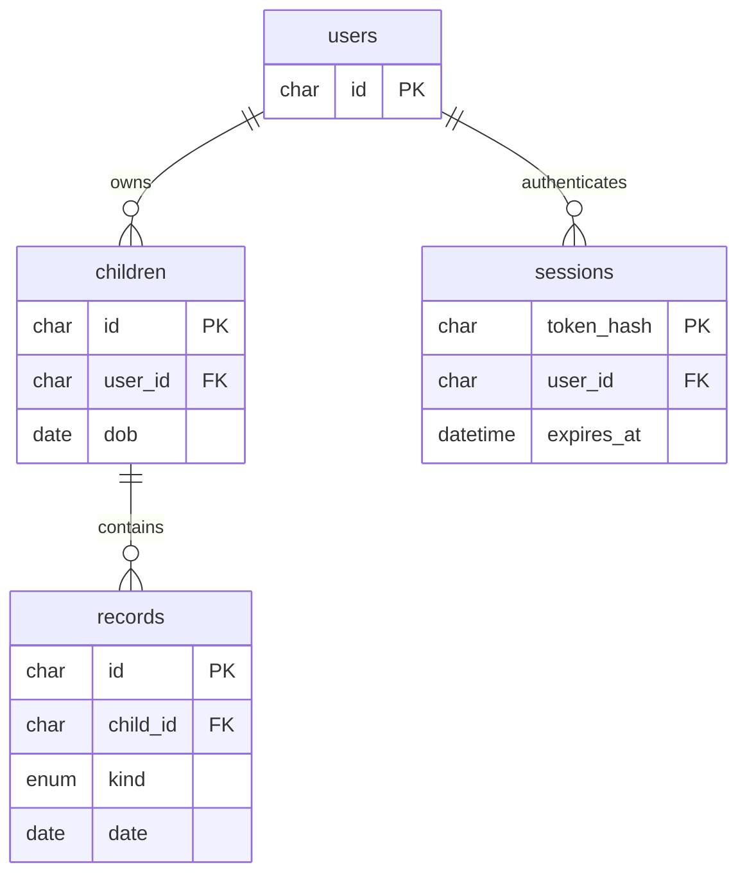

# TumbuhBersama

Aplikasi portofolio untuk orang tua mencatat pertumbuhan dan perkembangan anak sejak bayi. React 19, Tailwind CSS, Vite, Node.js/Express, dan MySQL.

## Fitur

- Akun orang tua: daftar, masuk, keluar, sesi cookie HttpOnly.
- Beberapa profil anak dengan akses berdasarkan pemilik.
- Pengukuran berat, panjang/tinggi badan, dan lingkar kepala; grafik serta riwayat.
- Jurnal perkembangan dengan kategori pengamatan orang tua.
- Catatan kunjungan lampau maupun mendatang.
- Tampilan responsif, formulir berlabel, pesan kesalahan, dan kondisi tanpa data.
- Demo berisi data fiktif yang terisolasi untuk setiap sesi.

Grafik hanya menampilkan data yang dimasukkan, bukan kurva WHO, skrining, diagnosis, atau rekomendasi medis. Batas numerik pada formulir adalah validasi teknis, bukan rentang normal pertumbuhan. Fokus awal adalah usia 0–5 tahun; profil tetap dapat disimpan saat anak bertambah usia.

## Status lokal saat ini

MySQL Laragon di `D:/laragon` sudah terhubung. Database `tumbuh_bersama` dan akun aplikasi terbatas sudah dibuat; kredensial tersimpan hanya dalam `.env` lokal. Mulai dari halaman Daftar untuk membuat akun sendiri. Mode aktif adalah MySQL, bukan demo. Pastikan MySQL Laragon aktif saat menjalankan aplikasi kembali.

## Menjalankan demo lokal

Gunakan Node.js 22.13+ (atau Node.js 24+) agar sesuai dengan persyaratan seluruh tooling yang terpasang.

```sh
npm install
```

Salin `.env.example` menjadi `.env`, lalu ubah `DEMO_MODE=true`. Jalankan:

```sh
npm run dev:all
```

Buka http://127.0.0.1:5173 dan pilih **Jelajahi dengan data fiktif**. Vite memproksikan `/api` ke server pada port 3001. Data demo disimpan dalam memori server; refresh tetap mempertahankan sesi, tetapi logout dan restart server menghapus data demo. Mode ini untuk data fiktif saja. Akun sungguhan tidak dibuat di mode demo.

## Mengaktifkan MySQL

1. Jalankan MySQL 8+. Gunakan akun administrator database untuk mengimpor `server/schema.sql`, misalnya melalui tab Import di phpMyAdmin. Skrip membuat database `tumbuh_bersama` dan empat tabel.
2. Buat user database khusus aplikasi yang memiliki izin SELECT, INSERT, UPDATE, DELETE pada `tumbuh_bersama.*`.
3. Isi `.env` lokal:

```dotenv
DEMO_MODE=false
DB_HOST=127.0.0.1
DB_PORT=3306
DB_USER=tumbuh_app
DB_PASSWORD=isi_password_database_lokal
DB_NAME=tumbuh_bersama
PORT=3001
APP_ORIGIN=http://127.0.0.1:5173

```

4. Restart `npm run dev:all`. Form registrasi dan login menggantikan tombol demo. Buat akun, tambahkan profil anak, dan isi catatan.

`.env` tidak masuk Git. Data demo tidak dipindahkan ke MySQL. Sesi akun MySQL disimpan dalam tabel `sessions`, berlaku 24 jam, dengan token acak yang hanya disimpan dalam bentuk hash di database. Kata sandi menggunakan bcrypt. Semua endpoint catatan memeriksa kepemilikan profil anak; query MySQL memakai parameter.

## Struktur

```text
src/App.jsx             Antarmuka dan alur pengguna
src/index.css           Tailwind dan gaya aplikasi responsif
server/index.js         API Express, autentikasi, adapter demo/MySQL
server/schema.sql       Skema database
server/api.test.js      Pengujian API mode demo
vite.config.js          React, Tailwind, dan proxy API
.env.example            Contoh konfigurasi tanpa rahasia
```



## API

Semua request POST menggunakan JSON. Endpoint profil dan catatan membutuhkan sesi login.

| Metode     | Endpoint                    | Fungsi                                        |
| ---------- | --------------------------- | --------------------------------------------- |
| GET        | `/api/me`                   | Status login dan ketersediaan demo            |
| POST       | `/api/register`             | Daftar: name, email, password                 |
| POST       | `/api/login`                | Masuk: email, password                        |
| POST       | `/api/logout`               | Hapus sesi                                    |
| POST       | `/api/demo`                 | Mulai sesi demo fiktif; hanya mode demo lokal |
| GET / POST | `/api/children`             | Daftar / buat profil: name, dob, sex          |
| GET / POST | `/api/children/:id/records` | Daftar / buat catatan                         |

Jenis catatan POST:

```json
{
  "kind": "measurement",
  "date": "2026-09-01",
  "weight": 7.7,
  "height": 68,
  "head": 42.5
}
```

```json
{
  "kind": "journal",
  "date": "2026-09-01",
  "title": "Meraih mainan",
  "category": "Gerak tubuh",
  "notes": "Pengamatan orang tua"
}
```

```json
{
  "kind": "visit",
  "date": "2026-10-01",
  "title": "Kunjungan posyandu",
  "notes": "Bawa buku KIA"
}
```

Kategori jurnal: Gerak tubuh, Komunikasi, Interaksi sosial, Kemandirian, Momen lainnya. Pengukuran maksimal satu per anak per tanggal. Tanggal sebelum kelahiran ditolak; pengukuran dan jurnal masa depan ditolak. Kunjungan boleh berada di masa depan.

## Verifikasi

```sh
npm test
npm run lint
npm run build
```

Pengujian API mencakup sesi, akses tanpa login, isolasi dua orang tua, akses baca/tulis lintas pemilik, tanggal tidak valid, nilai negatif, tanggal sebelum kelahiran, duplikasi pengukuran, simpan/baca jurnal dan kunjungan, origin asing, serta logout.

Build, lint, dan tes API mode demo telah dijalankan. Integrasi MySQL 8.0.30 dari Laragon juga sudah diuji: registrasi, login, hash kata sandi, isolasi pemilik, duplikasi pengukuran, simpan/baca catatan, logout, dan persistensi setelah login ulang. Data pengujian dihapus sesudah tes. Pengujian tampilan melalui browser belum dilakukan.

Tes MySQL tambahan bersifat opt-in. Di PowerShell: `$env:TEST_MYSQL="true"; npm test`. Tes membuat akun fiktif unik lalu menghapus akun tersebut beserta catatannya.

## Menjalankan hasil build

`npm run build`, lalu `npm start` menyajikan hasil frontend dan API pada http://127.0.0.1:3001. Sesuaikan `APP_ORIGIN=http://127.0.0.1:3001` untuk akses langsung ini.

Untuk hosting akun sungguhan, gunakan host Node.js dengan koneksi MySQL dan reverse proxy HTTPS, atur `DEMO_MODE=false`, `NODE_ENV=production`, serta `APP_ORIGIN` ke origin HTTPS yang benar. Server sengaja bind ke loopback untuk diakses lewat reverse proxy. Cookie secure aktif pada production. Mode demo ditolak saat production.

Hosting Sites yang tersedia memakai Cloudflare Workers dan tidak mendukung koneksi TCP MySQL langsung dari aplikasi Express ini. Belum dilakukan deployment; stack Node.js dan MySQL yang diminta tetap dipertahankan.

## Pengembangan berikutnya

Versi ini menyediakan pembuatan dan pembacaan catatan. Edit/hapus, ekspor, reset kata sandi, verifikasi email, pengingat otomatis, serta kurva standar kesehatan belum diimplementasikan. Sebelum dipakai untuk data keluarga nyata, tambahkan pengelolaan penghapusan data, pencadangan, kebijakan retensi, dan peninjauan keamanan deployment.

## Artikel edukasi

Menu **Artikel** menyediakan empat bacaan awal, pencarian judul/topik, filter kategori, dan halaman detail beserta sumber WHO/UNICEF. Artikel dapat dibaca setelah login tanpa perlu membuat profil anak. Tanggal pemeriksaan rujukan dicantumkan; materi merupakan ringkasan edukasi, bukan diagnosis atau review klinis.

Konten editorial dikelola dalam `server/articles.js`, bukan melalui panel admin atau tabel MySQL. Untuk menambahkan artikel, ikuti struktur slug unik, kategori, judul, ringkasan, kelompok usia, tanggal pembaruan, sumber resmi, dan bagian isi. Pencarian dan kategori berjalan di frontend atas katalog dari API. Tidak ada unggahan HTML artikel dari pengguna.

- `GET /api/articles`: katalog ringkasan; memerlukan sesi login.
- `GET /api/articles/:slug`: isi lengkap atau respons 404; memerlukan sesi login.
- `src/Articles.jsx`: daftar, pencarian, filter, dan tampilan baca.

Tes API mencakup proteksi login, katalog, keunikan slug, detail seluruh artikel, domain rujukan, dan slug yang tidak ditemukan.

## Forum sesama mom

Menu **Forum** tersedia setelah login dan tidak membutuhkan profil anak. Pengguna dapat membuat diskusi dalam lima kategori, mencari isi/judul, membaca topik terbaru, membalas, memuat ulang percakapan, dan menghapus tulisan sendiri dengan konfirmasi. Diskusi bersifat bersama untuk seluruh akun yang login; email, ID pemilik, dan data anak tidak ditampilkan dalam respons forum.

Data disimpan di tabel `forum_topics` dan `forum_comments` MySQL. Instalasi baru dapat memakai `server/schema.sql`. Untuk database lama, jalankan `server/migrations/001_forum.sql` dengan akun database yang memiliki izin CREATE TABLE. Migrasi sudah diterapkan pada Laragon lokal. Mode demo sementara tidak menyediakan forum bersama.

- `GET /api/forum?q=&category=&page=1`: daftar terbaru, 20 topik per halaman.
- `POST /api/forum`: membuat topik dengan `title`, `category`, `body`.
- `GET /api/forum/:id`: isi diskusi, penulis, jumlah komentar, dan status kepemilikan.
- `DELETE /api/forum/:id`: menghapus topik sendiri beserta seluruh komentarnya.
- `GET /api/forum/:id/comments?page=1`: komentar berurutan, 50 per halaman.
- `POST /api/forum/:id/comments`: mengirim komentar dengan `body`.
- `DELETE /api/forum/:id/comments/:commentId`: menghapus komentar sendiri.

Batas: judul 160 karakter, diskusi 5.000, komentar 2.000, pencarian 120; kiriman maksimal 15 operasi tulis per menit per IP. Teks dirender sebagai teks React, bukan HTML mentah. Konten kesehatan anggota adalah pengalaman pribadi, bukan diagnosis atau rekomendasi klinis.

`server/forum.test.js` menguji dua akun, akses tanpa login, validasi, pencarian, privasi respons, komentar, larangan menghapus tulisan orang lain, pagination, dan penghapusan berantai. Aktifkan `TEST_MYSQL=true` untuk menjalankannya. Dengan `TEST_LIVE_FORUM=true`, tes tersebut mengarah ke server lokal port 5173. Semua akun dan konten pengujian dibersihkan sesudah tes.

Versi awal belum memiliki notifikasi real-time, edit tulisan, panel moderator, atau pelaporan konten. Gunakan tombol muat ulang untuk mengambil kiriman terbaru. Siapkan moderasi sebelum forum dibuka luas untuk publik.

### Like diskusi

Tombol Suka tersedia pada kartu dan detail diskusi, menampilkan jumlah like serta status akun saat ini. Klik kembali untuk membatalkan. Tombol like memiliki area interaksi sendiri sehingga tidak membuka detail kartu.

Penyimpanan memakai tabel `forum_likes` dengan primary key gabungan `(topic_id,user_id)`: satu akun hanya memiliki satu like per diskusi, termasuk saat request diulang atau datang bersamaan. `PUT /api/forum/:id/like` menerima `{ "liked": true }` atau `{ "liked": false }`; hasil berisi `liked` dan `like_count`. User selalu diambil dari sesi server. Respons katalog/detail juga menyertakan kedua nilai tersebut, tanpa daftar identitas penyuka. Pembatasan like: 60 request per menit per IP.

Untuk database lama, jalankan `server/migrations/002_forum_likes.sql` setelah migrasi forum pertama. Migrasi ini sudah diterapkan pada Laragon lokal. Schema instalasi baru juga sudah diperbarui. Like ikut dihapus ketika topik atau akun pemilik like dihapus. Pengujian mencakup akses tanpa login, validasi boolean, dua akun, duplikasi paralel, batal suka berulang, persistensi, serta penghapusan berantai.

## Notifikasi dalam aplikasi

Ikon lonceng pada header menampilkan balasan dan like dari pengguna lain pada diskusi milik akun yang sedang login. Aktivitas sendiri tidak membuat notifikasi. Notifikasi menampilkan nama pelaku dan judul topik; mengekliknya menandai dibaca dan membuka diskusi tersebut. Tersedia tandai semua dibaca, jumlah belum dibaca, serta pagination 20 notifikasi. Pembaruan dikirim langsung melalui WebSocket. Saat koneksi terputus, polling setiap 30 detik digunakan sebagai cadangan ketika halaman terlihat. Daftar juga dimuat ulang saat tersambung kembali, jendela kembali aktif, atau panel dibuka. Ini notifikasi dalam aplikasi, bukan push browser, email, atau WhatsApp.

Migrasi `server/migrations/003_notifications.sql` menambahkan tabel `notifications` dan tiga trigger MySQL. Trigger membuat notifikasi dalam transaksi yang sama dengan komentar/like, tidak memicu notifikasi ganda untuk like yang sudah ada, dan menghapus notifikasi saat like dibatalkan. Foreign key menghapus notifikasi jika topik, komentar, atau akun terkait dihapus. Migrasi sudah diterapkan pada Laragon MySQL 8.0.30; untuk instalasi lain jalankan dengan akun yang memiliki izin CREATE TABLE dan TRIGGER. `server/schema.sql` mencakup instalasi baru. Notifikasi dibuat untuk aktivitas setelah migrasi, tanpa mengisi ulang aktivitas lama.

- `GET /api/notifications?page=1`: daftar pribadi, jumlah total, dan jumlah belum dibaca.
- `PUT /api/notifications/:id/read`: tandai satu notifikasi milik sendiri dibaca.
- `PUT /api/notifications/read-all`: tandai semua notifikasi milik sendiri dibaca.

Semua endpoint memerlukan sesi. ID notifikasi akun lain menghasilkan 404 pada operasi baca. Mode demo menampilkan daftar kosong. Pengujian dua akun meliputi penerima yang benar, tidak ada notifikasi aktivitas sendiri, deduplikasi like, privasi, status baca, tandai semua dibaca, dan penghapusan bersama topik. Tes juga dijalankan melalui server lokal aktif.

### WebSocket notifikasi

Socket.IO memakai transport WebSocket pada `/socket.io`, di server HTTP yang sama dengan API. Vite meneruskan koneksi dengan `ws: true`. Handshake memeriksa Origin terhadap `APP_ORIGIN` dan cookie sesi HttpOnly; server menentukan ruang akun, bukan ID yang dikirim client. Koneksi diputus saat sesi habis atau logout; sesi diperiksa kembali sebelum mengirim event. Tidak ada nama, isi, atau token dalam event `notifications:changed`: client mengambil data melalui endpoint API yang tetap memeriksa sesi.

Setelah perubahan forum berhasil disimpan, server memberi sinyal ke pemilik diskusi. Tanda dibaca disinkronkan ke semua koneksi akun yang sama. Database tetap menjadi sumber data sehingga notifikasi saat offline muncul ketika koneksi kembali. Polling hanya cadangan saat WebSocket tidak terhubung. Panel menampilkan status koneksi.

Untuk deployment, reverse proxy harus meneruskan HTTP Upgrade pada `/socket.io/`, menggunakan WSS/HTTPS, dan mempertahankan Origin aplikasi yang benar. Implementasi saat ini untuk satu proses Node.js. Deployment beberapa proses/instance memerlukan adapter pub/sub, misalnya Redis, agar event lintas instance tersampaikan. Perubahan langsung ke database di luar API tidak memicu event WebSocket; data tetap terlihat saat panel dimuat ulang.

`server/realtime.test.js` mencakup pengiriman lewat WebSocket, isolasi tiga akun, dua tab, penolakan koneksi tanpa sesi/origin asing, sinkronisasi dibaca, koneksi ulang, batal like, dan logout. Aktifkan `TEST_MYSQL=true`; `TEST_LIVE_SOCKET=true` menjalankan tes ini melalui server lokal port 5173. Akun uji dihapus setelah selesai.

Referensi implementasi: [middleware autentikasi Socket.IO](https://socket.io/docs/v4/middlewares/), [rooms](https://socket.io/docs/v4/rooms/), dan [opsi client](https://socket.io/docs/v4/client-options/).

## Balas komentar dan mention

Setiap komentar mempunyai tombol **Balas**. Tombol tersebut memilih komentar tujuan, menampilkan nama `@pengguna` dan kutipannya, lalu memfokuskan kolom balasan. Balasan dapat dibalas lagi. Mention di sini ditentukan dari komentar tujuan, bukan pencarian nama bebas lewat pengetikan `@`.

`POST /api/forum/:id/comments` menerima `parent_id` opsional. Server memastikan komentar tersebut masih ada dalam diskusi yang sama dan mengambil penulisnya dari database, sehingga client tidak dapat memalsukan penerima mention. Respons komentar menyertakan `parent_id`, `is_reply`, `reply_to_name`, dan `parent_excerpt`, tanpa email atau ID akun penerima.

Daftar mengelompokkan balasan di bawah komentar asal yang tersedia pada halaman yang sama. Indentasi dibatasi dua tingkat agar tetap nyaman di ponsel; relasi reply tetap dapat berlanjut lebih dalam. Jika komentar asal berada pada halaman lain, kutipannya tetap ditampilkan. Menghapus komentar asal mempertahankan balasannya dengan penanda bahwa komentar asal telah dihapus.

Penulis komentar tujuan menerima notifikasi jenis `reply` melalui WebSocket. Pemilik topik tetap menerima notifikasi, tanpa duplikasi jika ia juga penerima reply, dan aktivitas sendiri tidak memicu notifikasi untuk diri sendiri. Penerima diambil server dari relasi komentar.

Migrasi `server/migrations/004_comment_replies.sql` sudah diterapkan pada Laragon lokal. Jalankan sekali pada database versi sebelumnya; migrasi menambah relasi self-reference, penerima reply, jenis notifikasi, dan memperbarui trigger komentar. `server/schema.sql` menyediakan struktur terbaru untuk instalasi baru.

Pengujian `server/replies.test.js` mencakup pengelompokan komentar, reply dari tiga akun, reply terhadap reply, penerima mention yang tidak dapat dipalsukan, notifikasi WebSocket, validasi lintas topik, reply ke diri sendiri, dan penghapusan komentar asal. `TEST_MYSQL=true` mengaktifkan pengujian database; `TEST_LIVE_REPLIES=true` menguji lewat server aktif port 5173.

## Lampiran foto dan video forum

Diskusi, komentar, dan reply bertingkat mendukung maksimal 4 lampiran. Format foto: JPG/PNG/WebP, maksimal 5 MB per foto. Format video: MP4/WebM, maksimal 10 MB per video. Total maksimal 20 MB per kiriman. Teks cerita/balasan tetap wajib diisi. Pemilih file menyediakan pratinjau dan hapus pilihan sebelum kirim. Foto bisa dibuka ukuran penuh, video memakai pemutar browser tanpa autoplay; kompatibilitas codec mengikuti browser.

Endpoint POST diskusi/komentar menerima multipart dengan field `media` berulang serta field teks sebelumnya. JSON tanpa media tetap didukung. Parser dijalankan setelah autentikasi dan rate limit; server memeriksa signature file, jumlah dan ukuran, bukan mempercayai ekstensi atau MIME client. Signature bukan pemeriksaan antivirus atau validasi penuh codec. Media dibaca lewat `GET /api/forum/media/:id`, membutuhkan sesi login dan mendukung HEAD serta byte ranges untuk seek video. Respons tanpa cache dan nosniff; tidak ada URL publik.

Jalankan `server/migrations/005_forum_media.sql` pada database lama setelah migrasi 004. Migrasi sudah diterapkan pada Laragon lokal. Untuk instalasi baru gunakan schema lengkap. Data biner disimpan sebagai MEDIUMBLOB di MySQL dalam transaksi yang sama dengan kiriman; kegagalan membatalkan keduanya. Foreign key menghapus lampiran bersama komentar/topik/akun pemilik kiriman. Backup database mencakup media. Pastikan `max_allowed_packet` minimal 16 MB; untuk penggunaan berskala besar, pindahkan blob ke object storage privat. Reverse proxy perlu menerima request multipart hingga sekitar 21 MB. Aplikasi tidak melakukan kompresi/transcoding atau menghapus metadata foto.

`server/media.test.js` menguji upload foto dan signature MP4, reply bertingkat, otorisasi, batas jumlah/ukuran/jenis, range bytes, serta cascade deletion. Jalankan dengan `TEST_MYSQL=true`; tambahkan `TEST_LIVE_MEDIA=true` untuk menguji melalui Vite port 5173. Fixture video menguji transport container, bukan playback codec atau tampilan visual browser.

## CAPTCHA login dan daftar

Login dan daftar memerlukan CAPTCHA gambar lokal berisi 5 karakter. Huruf ambigu seperti I/O/1/0 tidak dipakai, jawaban tidak membedakan kapital, tersedia tombol ganti kode. Tombol submit menunggu kode tersedia dan kode diperbarui setelah kegagalan autentikasi. Form setelah login tidak meminta CAPTCHA. Logo minimal aktif berada di `public/logo-simple.svg` dan digunakan pada branding serta favicon.

Jalankan `server/migrations/006_auth_captcha.sql` untuk database lama; sudah diterapkan di Laragon lokal. `GET /api/captcha` mengembalikan ID, gambar SVG berbasis path, dan masa berlaku 300 detik, tanpa jawaban. Endpoint login/daftar membutuhkan `captcha_id` dan `captcha_answer`. Jawaban dihasilkan memakai crypto.randomInt; hanya hash yang disimpan di MySQL. Setiap percobaan menghabiskan challenge termasuk jawaban salah; DELETE affectedRows mencegah penggunaan bersamaan. Data kedaluwarsa dibersihkan saat kode baru diminta. Kode yang ditinggalkan saat refresh tetap tidak berlaku setelah 5 menit. Endpoint kode dibatasi 30 permintaan per 5 menit per IP, autentikasi tetap 30 per 15 menit. Respons memakai no-store dan batas global 5.000 challenge aktif.

CAPTCHA ini perlindungan anti-bot dasar, bukan MFA/OTP atau bukti identitas; OCR canggih masih dapat menyelesaikannya. CAPTCHA bersifat visual, belum menyediakan audio. Tidak memerlukan API key atau layanan eksternal. Mode demo tetap menggunakan tombol demo.

Tes memakai fixture challenge berjawaban diketahui yang dimasukkan langsung oleh test helper ke database, tanpa pengecualian CAPTCHA di endpoint produksi. `server/captcha.test.js` memeriksa kode wajib/salah/kedaluwarsa, konsumsi sekali pakai termasuk request paralel, normalisasi jawaban, serta endpoint gambar. Jalankan `TEST_MYSQL=true`; `TEST_LIVE_CAPTCHA=true` menguji lewat server port 5173.

## Kurva persentil WHO dan milestone

Halaman Ringkasan/Pertumbuhan kini menampilkan referensi menurut usia untuk berat badan, panjang/tinggi, dan lingkar kepala, terpisah laki-laki/perempuan. Garis P1/P5/P10/P25/P50/P75/P90/P95/P99 memakai data harian resmi WHO; usia pengukuran dihitung dari tanggal lahir dalam hari UTC. Pengguna dapat memilih rentang 6/24/60 bulan, mengeklik titik atau memilih tanggal untuk membaca persentil, serta melihat ukuran saat lahir (hanya bila ada catatan hari 0), terakhir, dan perubahan sejak lahir. Di mobile grafik dapat digeser agar label tetap terbaca. Data WHO dimuat sebagai chunk terpisah saat grafik dibuka.

`shared/data/who-lms.json` memuat 11.142 baris LMS (6 seri × 1.857 hari). Sumber unduhan resmi, SHA-256, dan tanggal pengambilan tersedia di `shared/data/who-sources.json`. Referensi mendukung hari 0–1856, sesuai batas 60 bulan lengkap pada tabel WHO; tidak ada ekstrapolasi di luar rentang. Sumbu bulan menggunakan 30,4375 hari/bulan sesuai [petunjuk WHO](https://cdn.who.int/media/docs/default-source/child-growth/child-growth-standards/indicators/instructions-en.pdf?sfvrsn=5cec8c61_23). Z-score memakai LMS, persentil memakai CDF normal. Ekor ekstrem ditampilkan <P0,1 atau >P99,9 agar tidak memberi ketelitian semu. Ini pemantauan referensi, bukan diagnosis atau klasifikasi status gizi. Belum mengoreksi usia prematur.

Form pengukuran meminta posisi telentang/berdiri. Sesuai [metode WHO Anthro](https://worldhealthorganization.github.io/anthro/reference/anthro_zscores.html), tinggi berdiri di bawah 731 hari ditambah 0,7 cm; panjang telentang mulai hari 731 dikurangi 0,7 cm untuk perhitungan. Nilai asli tetap tersimpan. Kurva panjang/tinggi sengaja terputus antara hari 730 dan 731. Data lama tanpa posisi memakai asumsi sesuai usia dengan penanda **persentil sementara**. Pilih tanggal dan posisi pada detail grafik untuk mengonfirmasi posisi sebenarnya; perubahan disimpan lewat endpoint PUT records/:recordId/position yang memeriksa kepemilikan.

Menu **Milestone** menyediakan ringkasan pilihan kemampuan pada 1, 2, 4, 6, 9, 12, 15, 18, dan 24 bulan. Usia 1 bulan bersumber AAP/HealthyChildren; usia berikutnya dari CDC, dengan tautan sumber per tahap di `shared/milestones.js`. Ini adaptasi bahasa Indonesia untuk pengamatan keluarga, bukan terjemahan resmi, checklist lengkap CDC, atau instrumen skrining tervalidasi. Usia antara dua tahap memilih tahap lebih muda; tahap yang lebih tua ditandai pratinjau, dan anak di atas 24 bulan diberi keterangan bahwa katalog digunakan untuk riwayat. Jumlah centang hanya menghitung pengamatan, tidak memberi skor perkembangan atau label lulus/gagal. Nasihat untuk berdiskusi dengan dokter bila ada kekhawatiran/kehilangan kemampuan ditampilkan.

Centang dan tanggal pengamatan tersimpan per anak melalui GET /api/children/:id/milestones dan PUT /api/children/:id/milestones/:milestoneId, dengan body `{checked, observed_date}`. Tanggal harus valid, tidak sebelum lahir atau sesudah hari ini. ID milestone divalidasi server, operasi idempoten, akses lintas anak/akun ditolak, dan catatan ikut terhapus bersama anak. Mode demo menyimpan sementara dan membersihkan catatan saat logout.

Untuk database lama, jalankan `server/migrations/007_growth_milestones.sql` sekali. Sudah diterapkan pada Laragon lokal. Instalasi baru menggunakan `server/schema.sql`. Jalankan `node tools/download-who.mjs` lalu `python tools/import_who.py` dari root repo untuk membangun ulang dataset; `.who-cache/` tidak dilacak git. Dataset disimpan lokal sehingga tidak membutuhkan koneksi WHO saat digunakan.

Pengujian `server/growth.test.js` membandingkan **100.278 nilai persentil harian** dengan nilai persentil independen dalam XLSX WHO (bukan hasil rumus aplikasi), serta menguji batas usia, tahun kabisat, jenis kelamin, CDF, dan transisi posisi ukur. Selisih maksimal pada data saat ini 0,0005 kg/cm (pembulatan tabel 3 desimal). `server/milestones.test.js` menguji persistensi, idempotensi, tanggal, isolasi dua anak/dua akun, cascade delete, serta penyimpanan dan koreksi posisi ukur. Aktifkan TEST_MYSQL=true; TEST_LIVE_GROWTH=true menguji melalui server Vite aktif.

## Kalender anak dan pengingat

Menu **Kalender** memuat kalender bulanan per anak, jadwal vaksin otomatis menurut tanggal lahir, serta janji dokter dengan jam WIB, lokasi, nama dokter, dan memo. Jadwal bisa diubah, dibatalkan, atau ditandai selesai dengan tanggal pelaksanaan. Catatan kunjungan lama diimpor sekali. Setiap anak dan akun memiliki kalender terpisah.

Acuan vaksin adalah [program imunisasi rutin bayi/baduta Kemenkes](https://ayosehat.kemkes.go.id/1000-hari-pertama-kehidupan/seputar-imunisasi), diakses 9 September 2026. Ada 20 dosis acuan sejak lahir hingga 18 bulan; JE tersedia sebagai tambahan khusus wilayah endemis. Rentang minggu mengonversi periode usia dalam bulan sejak lahir, **bukan batas aman pemberian vaksin**. HB 0 perlu dikonfirmasi dalam 24 jam pertama. Riwayat dosis, imunisasi kejar, batas usia produk, dan program heksavalen perlu disesuaikan dengan fasilitas kesehatan; aplikasi tidak menghitung imunisasi kejar atau menggeser dosis berikutnya otomatis. Daftar ini tidak mencakup seluruh vaksin tambahan maupun imunisasi usia sekolah.

Pengguna memilih pengingat H-7/H-3/H-1, hari H, atau nonaktif. Server memeriksa jadwal setiap menit dan saat daftar notifikasi dibuka. Pengingat tersimpan sekali per fase (menjelang dan hari H), dikirim ke akun pemilik melalui WebSocket, dan dapat ditandai dibaca. Mengedit memo tidak mengulang notifikasi; mengubah tanggal/jam/pilihan pengingat mengatur ulang pengingat. Menyelesaikan atau membatalkan jadwal menghapus pengingatnya. Jadwal lewat tetap terlihat untuk pencatatan, tetapi tidak mengirim alarm terlambat. Jam tanpa isian memakai 09.00 WIB untuk hitungan pengingat awal; pengingat hari H tersedia sejak pergantian tanggal WIB.

Pengingat dalam aplikasi memerlukan server aktif. Ini bukan Web Push, SMS, atau email saat browser ditutup. Tombol **Ekspor kalender** menghasilkan file `.ics` jadwal aktif beserta alarm; impor ke kalender ponsel dan aktifkan notifikasi di aplikasi kalender tersebut. Perubahan berikutnya di website tidak otomatis menyinkronkan file yang sudah diimpor.

Database lama perlu menjalankan `server/migrations/008_child_calendar.sql` (sudah diterapkan pada Laragon lokal); instalasi baru memakai schema lengkap. Mode demo menyimpan kalender sementara tanpa pengiriman notifikasi persisten. Tes `server/calendar.test.js` mencakup batas bulan/tahun kabisat, waktu WIB, ekspor ICS, persistensi, impor kunjungan, validasi, otorisasi, serta deduplikasi dan perubahan jadwal pengingat. Jalankan dengan `TEST_MYSQL=true` untuk pengujian database.

## Pembaruan pengalaman artikel

Seluruh area kartu artikel membuka halaman baca internal melalui tombol yang juga bisa diakses dengan keyboard. Empat artikel editorial memiliki enam bagian, contoh praktis, daftar isi, tanggal pembaruan, durasi baca, serta tautan rujukan. Tulisan ini merupakan konten TumbuhBersama, bukan salinan lengkap publikasi WHO/UNICEF.

Artikel disajikan melalui API internal `GET /api/articles` (metadata/ringkasan) dan `GET /api/articles/:slug` (isi lengkap), dengan sumber konten di `server/articles.js`. Belum ada API berita eksternal, sinkronisasi otomatis, atau CMS; penambahan/pembaruan tulisan masih melalui perubahan konten server. Refresh halaman mengambil ulang data server tetapi tidak menghasilkan artikel baru.

## Edit profil anak

Tombol **Edit profil** berada di samping Tambah anak. Nama panggilan, tanggal lahir, dan jenis kelamin dapat diperbarui melalui PUT /api/children/:id oleh pemilik akun. Form menampilkan nilai lama; pembatalan tidak menyimpan perubahan. Tidak ada migrasi database tambahan.

Perubahan tanggal lahir menyesuaikan usia, referensi pertumbuhan, dan periode vaksin. Vaksin berstatus planned yang tanggalnya masih sama dengan awal periode acuan mengikuti tanggal lahir baru. Jadwal yang tanggalnya sudah dipindahkan, dibatalkan, atau selesai dipertahankan; pengingat target yang berubah diatur ulang. Tanggal lahir yang melewati catatan pengukuran/jurnal, pengamatan milestone, atau jadwal/pelaksanaan yang dipertahankan ditolak agar riwayat tidak menjadi sebelum kelahiran. Perubahan database dijalankan dalam transaksi.

## Edit dan hapus riwayat pengukuran

Kolom Aksi pada Riwayat pengukuran menyediakan Edit dan Hapus. Form edit menampilkan tanggal, berat, panjang/tinggi, lingkar kepala, dan posisi ukur sebelumnya. Hapus memerlukan konfirmasi dan menghapus permanen catatan tersebut. State pengukuran diperbarui sehingga tabel, ringkasan, dan grafik mengikuti perubahan.

PUT dan DELETE `/api/children/:id/records/:recordId` hanya berlaku untuk pengukuran milik akun pengguna. Validasi tanggal, batas angka, posisi ukur, dan keunikan pengukuran per tanggal diterapkan di server. Endpoint ini tidak mengubah atau menghapus jurnal maupun kunjungan. Tidak memerlukan migrasi tambahan. Tes integrasi mencakup persistensi, konflik tanggal, data tidak valid, isolasi anak/akun, serta penghapusan tanpa memengaruhi catatan lain.
