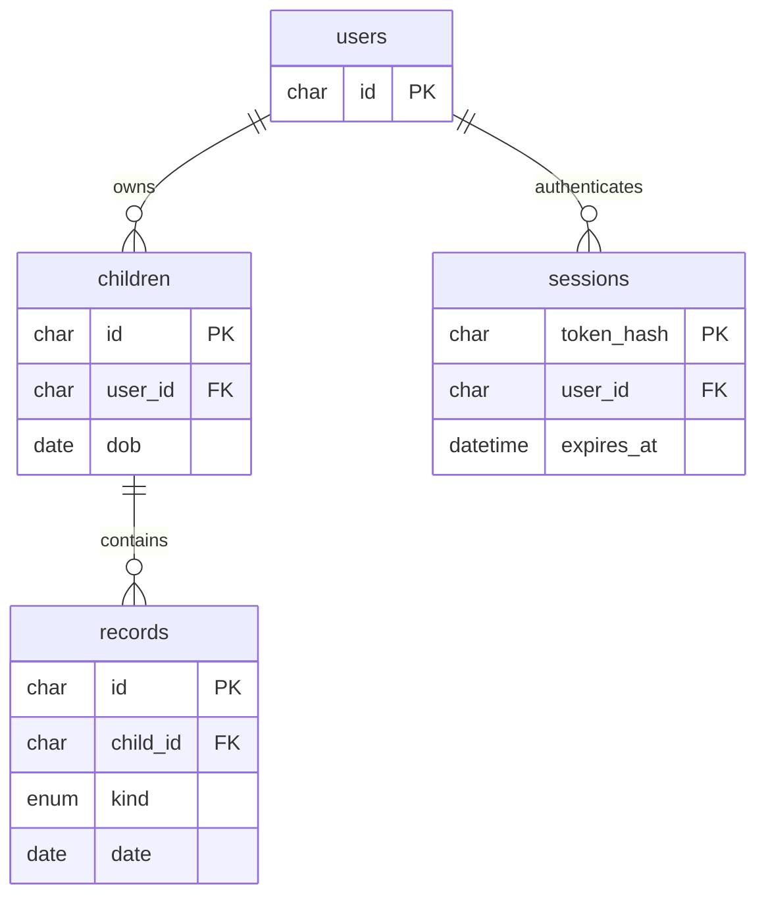

# TumbuhBersama

Aplikasi portofolio untuk orang tua mencatat pertumbuhan dan perkembangan anak sejak bayi. React 19, Tailwind CSS, Vite, Node.js/Express, dan MySQL.

## Fitur

- Akun orang tua: daftar, masuk, keluar, sesi cookie HttpOnly.
- Beberapa profil anak dengan akses berdasarkan pemilik.
- Pengukuran berat, panjang/tinggi badan, dan lingkar kepala; grafik serta riwayat.
- Jurnal perkembangan dengan kategori pengamatan orang tua.
- Catatan kunjungan lampau maupun mendatang.
- Tampilan responsif, formulir berlabel, pesan kesalahan, dan kondisi tanpa data.
- Demo berisi data fiktif yang terisolasi untuk setiap sesi.

Grafik hanya menampilkan data yang dimasukkan, bukan kurva WHO, skrining, diagnosis, atau rekomendasi medis. Batas numerik pada formulir adalah validasi teknis, bukan rentang normal pertumbuhan. Fokus awal adalah usia 0–5 tahun; profil tetap dapat disimpan saat anak bertambah usia.

## Status lokal saat ini

MySQL Laragon di `D:/laragon` sudah terhubung. Database `tumbuh_bersama` dan akun aplikasi terbatas sudah dibuat; kredensial tersimpan hanya dalam `.env` lokal. Mulai dari halaman Daftar untuk membuat akun sendiri. Mode aktif adalah MySQL, bukan demo. Pastikan MySQL Laragon aktif saat menjalankan aplikasi kembali.

## Menjalankan demo lokal

Gunakan Node.js 22.13+ (atau Node.js 24+) agar sesuai dengan persyaratan seluruh tooling yang terpasang.

```sh
npm install
```

Salin `.env.example` menjadi `.env`, lalu ubah `DEMO_MODE=true`. Jalankan:

```sh
npm run dev:all
```

Buka http://127.0.0.1:5173 dan pilih **Jelajahi dengan data fiktif**. Vite memproksikan `/api` ke server pada port 3001. Data demo disimpan dalam memori server; refresh tetap mempertahankan sesi, tetapi logout dan restart server menghapus data demo. Mode ini untuk data fiktif saja. Akun sungguhan tidak dibuat di mode demo.

## Mengaktifkan MySQL

1. Jalankan MySQL 8+. Gunakan akun administrator database untuk mengimpor `server/schema.sql`, misalnya melalui tab Import di phpMyAdmin. Skrip membuat database `tumbuh_bersama` dan empat tabel.
2. Buat user database khusus aplikasi yang memiliki izin SELECT, INSERT, UPDATE, DELETE pada `tumbuh_bersama.*`.
3. Isi `.env` lokal:

```dotenv
DEMO_MODE=false
DB_HOST=127.0.0.1
DB_PORT=3306
DB_USER=tumbuh_app
DB_PASSWORD=isi_password_database_lokal
DB_NAME=tumbuh_bersama
PORT=3001
APP_ORIGIN=http://127.0.0.1:5173

```

4. Restart `npm run dev:all`. Form registrasi dan login menggantikan tombol demo. Buat akun, tambahkan profil anak, dan isi catatan.

`.env` tidak masuk Git. Data demo tidak dipindahkan ke MySQL. Sesi akun MySQL disimpan dalam tabel `sessions`, berlaku 24 jam, dengan token acak yang hanya disimpan dalam bentuk hash di database. Kata sandi menggunakan bcrypt. Semua endpoint catatan memeriksa kepemilikan profil anak; query MySQL memakai parameter.

## Struktur

```text
src/App.jsx             Antarmuka dan alur pengguna
src/index.css           Tailwind dan gaya aplikasi responsif
server/index.js         API Express, autentikasi, adapter demo/MySQL
server/schema.sql       Skema database
server/api.test.js      Pengujian API mode demo
vite.config.js          React, Tailwind, dan proxy API
.env.example            Contoh konfigurasi tanpa rahasia
```



## API

Semua request POST menggunakan JSON. Endpoint profil dan catatan membutuhkan sesi login.

| Metode     | Endpoint                    | Fungsi                                        |
| ---------- | --------------------------- | --------------------------------------------- |
| GET        | `/api/me`                   | Status login dan ketersediaan demo            |
| POST       | `/api/register`             | Daftar: name, email, password                 |
| POST       | `/api/login`                | Masuk: email, password                        |
| POST       | `/api/logout`               | Hapus sesi                                    |
| POST       | `/api/demo`                 | Mulai sesi demo fiktif; hanya mode demo lokal |
| GET / POST | `/api/children`             | Daftar / buat profil: name, dob, sex          |
| GET / POST | `/api/children/:id/records` | Daftar / buat catatan                         |

Jenis catatan POST:

```json
{
  "kind": "measurement",
  "date": "2026-09-01",
  "weight": 7.7,
  "height": 68,
  "head": 42.5
}
```

```json
{
  "kind": "journal",
  "date": "2026-09-01",
  "title": "Meraih mainan",
  "category": "Gerak tubuh",
  "notes": "Pengamatan orang tua"
}
```

```json
{
  "kind": "visit",
  "date": "2026-10-01",
  "title": "Kunjungan posyandu",
  "notes": "Bawa buku KIA"
}
```

Kategori jurnal: Gerak tubuh, Komunikasi, Interaksi sosial, Kemandirian, Momen lainnya. Pengukuran maksimal satu per anak per tanggal. Tanggal sebelum kelahiran ditolak; pengukuran dan jurnal masa depan ditolak. Kunjungan boleh berada di masa depan.

## Verifikasi

```sh
npm test
npm run lint
npm run build
```

Pengujian API mencakup sesi, akses tanpa login, isolasi dua orang tua, akses baca/tulis lintas pemilik, tanggal tidak valid, nilai negatif, tanggal sebelum kelahiran, duplikasi pengukuran, simpan/baca jurnal dan kunjungan, origin asing, serta logout.

Build, lint, dan tes API mode demo telah dijalankan. Integrasi MySQL 8.0.30 dari Laragon juga sudah diuji: registrasi, login, hash kata sandi, isolasi pemilik, duplikasi pengukuran, simpan/baca catatan, logout, dan persistensi setelah login ulang. Data pengujian dihapus sesudah tes. Pengujian tampilan melalui browser belum dilakukan.

Tes MySQL tambahan bersifat opt-in. Di PowerShell: `$env:TEST_MYSQL="true"; npm test`. Tes membuat akun fiktif unik lalu menghapus akun tersebut beserta catatannya.

## Menjalankan hasil build

`npm run build`, lalu `npm start` menyajikan hasil frontend dan API pada http://127.0.0.1:3001. Sesuaikan `APP_ORIGIN=http://127.0.0.1:3001` untuk akses langsung ini.

Untuk hosting akun sungguhan, gunakan host Node.js dengan koneksi MySQL dan reverse proxy HTTPS, atur `DEMO_MODE=false`, `NODE_ENV=production`, serta `APP_ORIGIN` ke origin HTTPS yang benar. Server sengaja bind ke loopback untuk diakses lewat reverse proxy. Cookie secure aktif pada production. Mode demo ditolak saat production.

Hosting Sites yang tersedia memakai Cloudflare Workers dan tidak mendukung koneksi TCP MySQL langsung dari aplikasi Express ini. Belum dilakukan deployment; stack Node.js dan MySQL yang diminta tetap dipertahankan.

## Pengembangan berikutnya

Versi ini menyediakan pembuatan dan pembacaan catatan. Edit/hapus, ekspor, reset kata sandi, verifikasi email, pengingat otomatis, serta kurva standar kesehatan belum diimplementasikan. Sebelum dipakai untuk data keluarga nyata, tambahkan pengelolaan penghapusan data, pencadangan, kebijakan retensi, dan peninjauan keamanan deployment.

## Artikel edukasi

Menu **Artikel** menyediakan empat bacaan awal, pencarian judul/topik, filter kategori, dan halaman detail beserta sumber WHO/UNICEF. Artikel dapat dibaca setelah login tanpa perlu membuat profil anak. Tanggal pemeriksaan rujukan dicantumkan; materi merupakan ringkasan edukasi, bukan diagnosis atau review klinis.

Konten editorial dikelola dalam `server/articles.js`, bukan melalui panel admin atau tabel MySQL. Untuk menambahkan artikel, ikuti struktur slug unik, kategori, judul, ringkasan, kelompok usia, tanggal pembaruan, sumber resmi, dan bagian isi. Pencarian dan kategori berjalan di frontend atas katalog dari API. Tidak ada unggahan HTML artikel dari pengguna.

- `GET /api/articles`: katalog ringkasan; memerlukan sesi login.
- `GET /api/articles/:slug`: isi lengkap atau respons 404; memerlukan sesi login.
- `src/Articles.jsx`: daftar, pencarian, filter, dan tampilan baca.

Tes API mencakup proteksi login, katalog, keunikan slug, detail seluruh artikel, domain rujukan, dan slug yang tidak ditemukan.
